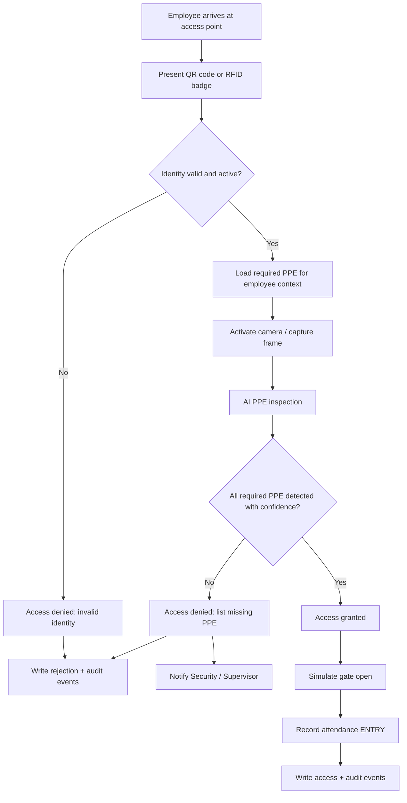
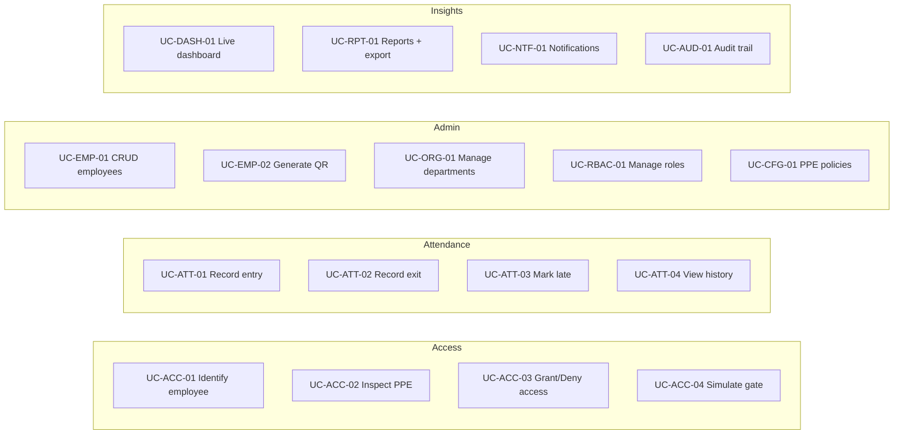

# 1. Functional Analysis

## 1.1 Business process (happy path)

### Exit process

1. Employee presents identity at exit point (or same kiosk in EXIT mode).
2. System validates identity and open attendance session.
3. System records EXIT with timestamp.
4. PPE inspection is **optional on exit** (configurable; default OFF for V1).
5. Simulate gate open; log event.

**Justification:** Entry PPE checks enforce site safety. Exit is primarily attendance closure; forcing PPE on exit adds friction without safety gain for V1.

---

## 1.2 Actors

| Actor | Description | Primary goals |
|-------|-------------|----------------|
| **Administrator** | System owner / IT | Configure platform, users, roles, PPE rules, cameras, integrations |
| **Security Guard** | Gate operator | Run live access control, resolve denials, monitor camera |
| **Supervisor** | Site / department lead | Monitor compliance, review rejections, oversee team attendance |
| **HR** | People operations | Manage employees/departments, attendance history, exports |
| **Employee** | Site worker | Identify at gate, view own attendance/profile (limited) |
| **System** | Platform services | AI inference, notifications, scheduling, audit persistence |

---

## 1.3 Use case catalog

| ID | Use case | Primary actor | Goal |
|----|----------|---------------|------|
| UC-ACC-01 | Identify employee | Guard / System | Resolve QR/RFID to employee |
| UC-ACC-02 | Inspect PPE | System | Detect helmet, vest, uniform |
| UC-ACC-03 | Decide access | System | Grant or deny with reasons |
| UC-ACC-04 | Simulate gate | System | UI + event representing open/close |
| UC-ATT-01 | Record entry | System | Create attendance punch |
| UC-ATT-02 | Record exit | System | Close open session |
| UC-ATT-03 | Detect late | System | Flag vs shift/policy |
| UC-ATT-04 | Attendance history | HR / Supervisor / Employee | Query historical punches |
| UC-EMP-01 | Manage employees | Admin / HR | CRUD + activate/deactivate |
| UC-EMP-02 | Generate QR | Admin / HR | Issue/regenerate badge code |
| UC-ORG-01 | Manage departments | Admin / HR | Org structure |
| UC-RBAC-01 | Roles & permissions | Admin | Assign roles |
| UC-CFG-01 | PPE policies | Admin | Required PPE by site/dept/role |
| UC-DASH-01 | Live dashboard | Guard / Supervisor / Admin | Operational awareness |
| UC-RPT-01 | Reports & export | HR / Supervisor / Admin | PDF/Excel |
| UC-NTF-01 | Notifications | System → users | Alerts for failures |
| UC-AUD-01 | Audit logs | Admin | Who did what, when |

---

## 1.4 User stories (prioritized)

### P0 — Must have for V1 demo

1. **As a Guard**, I scan an employee QR so the system knows who is requesting access.
2. **As the System**, I run PPE detection for helmet, vest, and uniform after identity is known.
3. **As the System**, I grant access only when all required PPE items pass thresholds.
4. **As the System**, I deny access and show missing PPE reasons when inspection fails.
5. **As the System**, I record ENTRY attendance only on granted access.
6. **As Admin/HR**, I create employees, departments, and generate QR codes.
7. **As Admin**, I configure which PPE items are required.
8. **As Guard/Supervisor**, I see a live dashboard of recent grants/denials.
9. **As Admin**, I manage users and assign roles.
10. **As any authenticated user**, I log in securely and see only allowed screens.

### P1 — Needed for internship completeness

11. **As HR**, I view attendance history and late flags.
12. **As HR/Supervisor**, I export attendance and rejection reports (PDF/Excel).
13. **As Admin**, I view audit logs for sensitive actions.
14. **As Guard**, I am notified when camera is offline or AI is unavailable.
15. **As Employee**, I view my own profile and attendance (read-only).
16. **As Guard**, I can manually retry capture when AI confidence is borderline (policy-driven).

### P2 — Nice for commercial polish

17. Optional RFID identity input field / simulated reader.
18. Configurable late threshold per department.
19. Notification center inbox with read/unread state.
20. Camera status heartbeats on dashboard.

---

## 1.5 Business rules

| ID | Rule | Justification |
|----|------|---------------|
| BR-01 | Access requires **identity + PPE pass**. Neither alone is sufficient. | Safety + accountability |
| BR-02 | Only **active** employees can enter. | Prevent terminated access |
| BR-03 | Required PPE is resolved from **policy** (global → department → role override). | Flexible industrial sites |
| BR-04 | Detection confidence must be ≥ configured threshold per class (default **0.70**). | Reduce false grants |
| BR-05 | On denial, **no attendance ENTRY** is written. | Attendance reflects physical presence inside site |
| BR-06 | On grant, exactly one ENTRY for the access event; duplicate scans within cooldown (default **60s**) are ignored or treated as duplicate. | Prevent double punches |
| BR-07 | EXIT closes the latest open ENTRY for that employee; if none, log anomaly (no silent invent). | Data integrity |
| BR-08 | Late = ENTRY timestamp > shift start + grace (default grace **10 min**). | HR reporting |
| BR-09 | Gate open is **simulated** (status + duration event); no hardware I/O in V1. | Scope control |
| BR-10 | Evidence image (frame snapshot) stored for **granted and denied** attempts (retention policy configurable). | Dispute resolution / audit |
| BR-11 | QR codes are unique, rotatable; old code invalidated on regenerate. | Security |
| BR-12 | All authz checks are server-side RBAC; UI hiding is not security. | Enterprise baseline |
| BR-13 | Soft-delete employees; historical attendance preserved. | Compliance |
| BR-14 | AI unavailable ⇒ access **denied by policy** (fail-closed) with clear reason. | Safety over convenience |
| BR-15 | Audit log is append-only from application perspective. | Non-repudiation |

---

## 1.6 Acceptance criteria (core flows)

### AC — Grant access

**Given** an active employee with valid QR  
**And** PPE policy requires helmet + vest + uniform  
**And** AI returns all three with confidence ≥ threshold  
**When** the access attempt completes  
**Then** system shows Access Granted  
**And** simulates gate open  
**And** creates attendance ENTRY  
**And** writes access_event status=`GRANTED`  
**And** stores evidence image reference  

### AC — Deny access (missing PPE)

**Given** identity is valid  
**And** AI misses at least one required class or confidence below threshold  
**When** inspection completes  
**Then** access is denied  
**And** UI lists each missing/failed PPE item  
**And** no ENTRY attendance is created  
**And** rejection notification is emitted to configured roles  
**And** access_event status=`DENIED` with structured reasons  

### AC — Invalid identity

**Given** unknown or inactive QR/RFID  
**When** scan is submitted  
**Then** deny immediately without calling AI  
**And** reason=`INVALID_IDENTITY` or `INACTIVE_EMPLOYEE`  

### AC — AI unavailable

**Given** AI health check fails or timeout exceeded  
**When** inspection is required  
**Then** deny with reason=`AI_UNAVAILABLE`  
**And** notify Security/Admin  
**And** do not mark attendance present  

---

## 1.7 Edge cases

| Scenario | Expected behavior |
|----------|-------------------|
| Blurry / empty frame | Deny or retry (max 2 retries); reason=`POOR_IMAGE_QUALITY` if quality gate fails |
| Multiple people in frame | V1: inspect whole frame; if ambiguous confidence, deny/`AMBIGUOUS_SCENE` (no person tracking) |
| Employee scans while already inside (open ENTRY) | Configurable: warn + allow re-entry log as anomaly, or deny duplicate ENTRY |
| Network drop mid-inspection | Fail-closed; client shows error; no partial grant |
| Clock skew / late batch sync | Server timestamps are authoritative (`created_at` UTC) |
| Concurrent scans same employee | Idempotency key / cooldown; one decision wins |
| Regenerated QR used with old printed badge | Old token rejected |
| Policy changed between scan and inference | Use policy snapshot at attempt start |
| Storage full for evidence images | Attempt logged; image upload failure → deny or grant per policy (default: still decide but flag `EVIDENCE_STORE_FAILED` + alert Admin) |
| Guard kiosk left logged in | Idle session timeout + optional kiosk mode token |
| Employee without department | Fall back to global PPE policy |
| Exit without entry | Create EXIT anomaly event; do not fabricate ENTRY |
| Very low light | Quality gate / deny with guidance to improve lighting |

---

## 1.8 Domain glossary (DDD ubiquitous language)

| Term | Meaning |
|------|---------|
| **Access Attempt** | One identification + inspection cycle |
| **Access Decision** | GRANTED / DENIED with reasons |
| **PPE Policy** | Required equipment set + thresholds |
| **Evidence Frame** | Snapshot used for AI + audit |
| **Attendance Punch** | ENTRY or EXIT record |
| **Open Session** | ENTRY without matching EXIT |
| **Gate Simulation** | Logical open/close event for UI/demo |
| **Fail-closed** | Prefer deny when uncertain or subsystem down |
