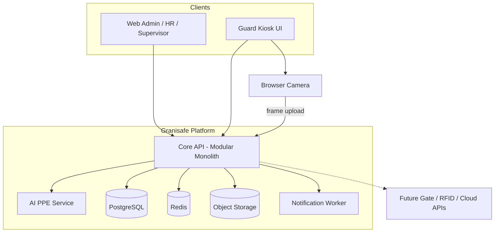
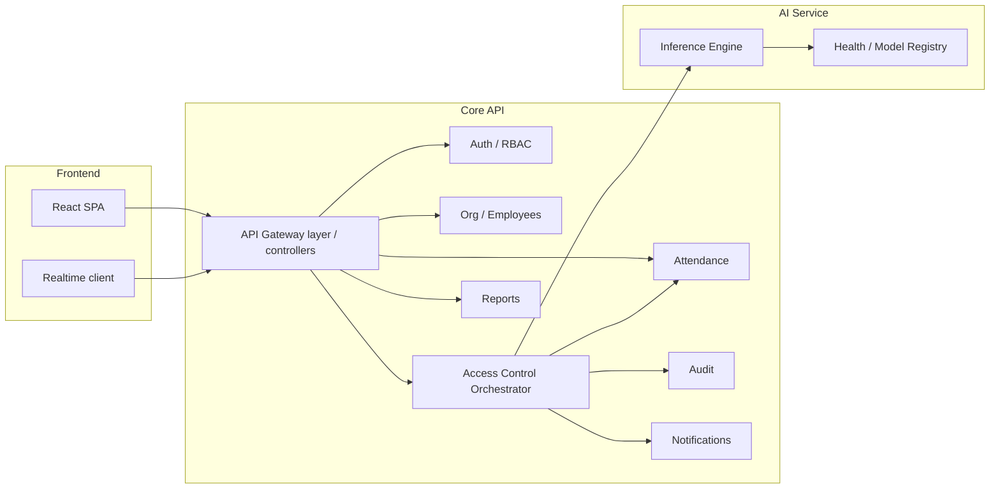
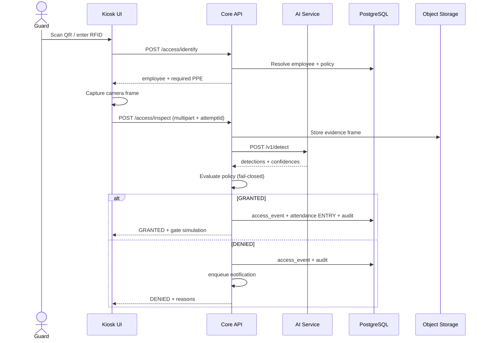
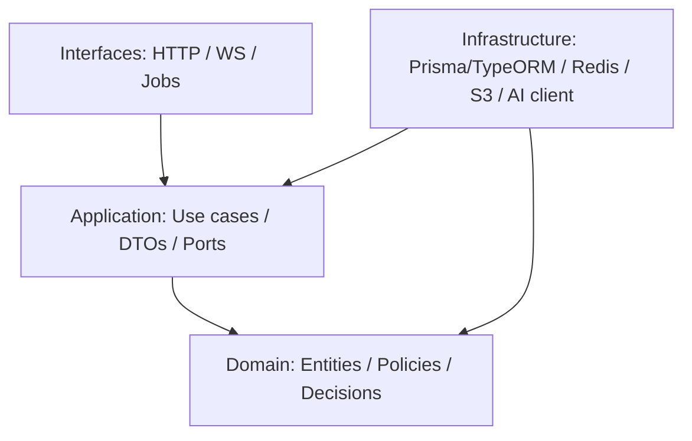
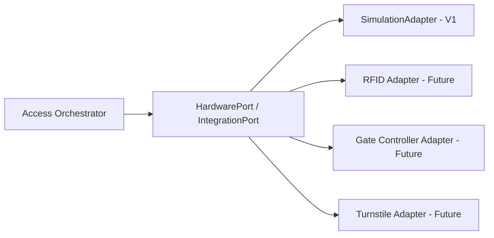
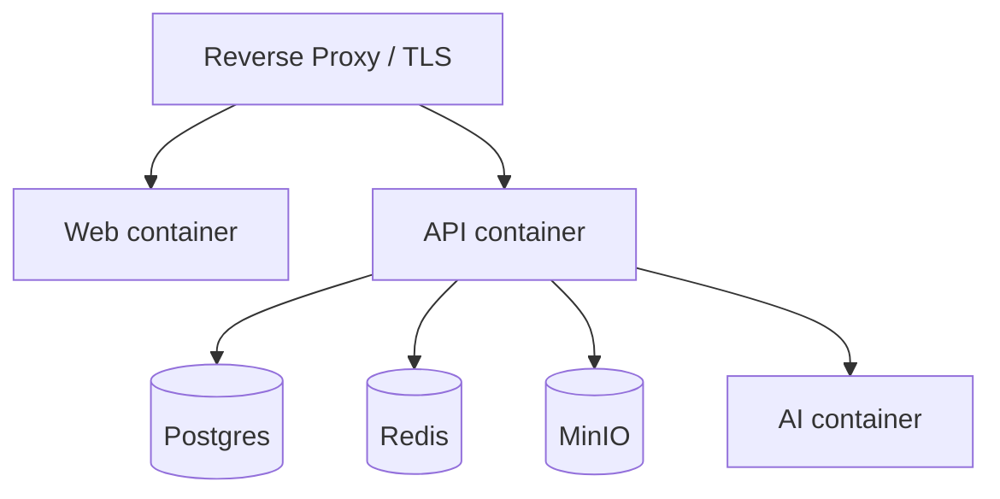

# 3. System Architecture

## 3.1 Recommended style: Modular Monolith + AI Sidecar

**Choice:** Modular monolith for the core platform API, with a **separate AI inference service**.

| Option | Verdict | Why |
|--------|---------|-----|
| Full microservices | Rejected for V1 | Ops overhead too high for internship; premature |
| Single process including AI | Rejected | Couples Python ML lifecycle to NestJS; harder GPU scaling |
| **Modular monolith + AI service** | **Selected** | Clean seams, one DB, simple deploy, commercial extraction path |
| Serverless-only | Rejected | Camera/AI latency and local demo constraints |

**Justification:** Granisafe can ship a maintainable enterprise core now, while treating AI as a replaceable module behind a stable HTTP contract—aligned with “AI is only one module.”

---

## 3.2 Architectural principles

1. **Clean Architecture** — `domain` ← `application` ← `infrastructure` / `interfaces`.
2. **Bounded contexts** — Identity/Access, Organization, Attendance, AccessControl, PPE/AI Orchestration, Reporting, Notifications, Audit.
3. **SOLID** — especially DIP: application depends on ports (interfaces), not YOLO or Nest specifics.
4. **Fail-closed safety** — uncertainty and dependency failure deny access.
5. **Event trail** — every attempt produces durable domain events for dashboard/audit/reports.
6. **Commercial hooks** — `company_id` reserved; integration façade for future hardware/APIs.

---

## 3.3 Context diagram

---

## 3.4 Container / component view

---

## 3.5 Access attempt sequence

---

## 3.6 Layering (Clean Architecture)

**Example domain service:** `AccessDecisionService` applies PPE policy to detection results—no HTTP, no ORM, no YOLO imports.

---

## 3.7 Major components

| Component | Responsibility | Why separate |
|-----------|----------------|--------------|
| **Frontend SPA** | Admin UX + Guard kiosk | Different UX density; one codebase with route guards |
| **Core API** | Business workflows, RBAC, persistence | System of record |
| **AI Service** | Model load + inference only | Independent runtime, scaling, language |
| **PostgreSQL** | Relational system of record | Strong consistency for attendance/access |
| **Redis** | Rate limits, pub/sub, short-lived locks, refresh denylist | Speed + realtime fanout |
| **Object storage** | Evidence frames, report exports | Binary off DB |
| **Notification service** | Async alerts | Keep request path thin |
| **Auth module** | JWT issue/validate, password hashing | Central trust boundary |

---

## 3.8 Authentication placement

- Login → Core API Auth module.
- Access token in `Authorization: Bearer` for API.
- Refresh token as HttpOnly Secure SameSite cookie (preferred) or rotating opaque token.
- Frontend never embeds AI service credentials; only Core API calls AI with service-to-service token.

---

## 3.9 Storage strategy

| Data | Store |
|------|-------|
| Users, employees, attendance, events | PostgreSQL |
| Evidence JPEG/PNG | MinIO (dev) / S3-compatible (prod) |
| Generated PDF/Excel | Object storage + short-lived signed URLs |
| Ephemeral camera preview | Browser memory only; only selected frame uploaded |

---

## 3.10 Notification service

- In-process queue (BullMQ + Redis) for V1.
- Channels: in-app persistence; email stub interface for later.
- Triggers: DENIED access, AI down, camera heartbeat miss.

**Justification:** BullMQ keeps architecture simple while teaching enterprise async patterns.

---

## 3.11 Future API integrations (façade)

V1 ships only `SimulationAdapter`. No refactor of orchestrator when hardware arrives.

---

## 3.12 Deployment topology (V1)

Docker Compose for local/staging; same images promote to production VM/cloud later.

---

## 3.13 Risks & mitigations

| Risk | Mitigation |
|------|------------|
| AI false grants | Thresholds, fail-closed, evidence audit |
| Model latency | Async progress UI, GPU optional profile, timeout |
| Scope creep into research | Frozen class list; no custom training required for V1 demo |
| Monolith mud | Enforced module boundaries + lint rules / CODEOWNERS later |
