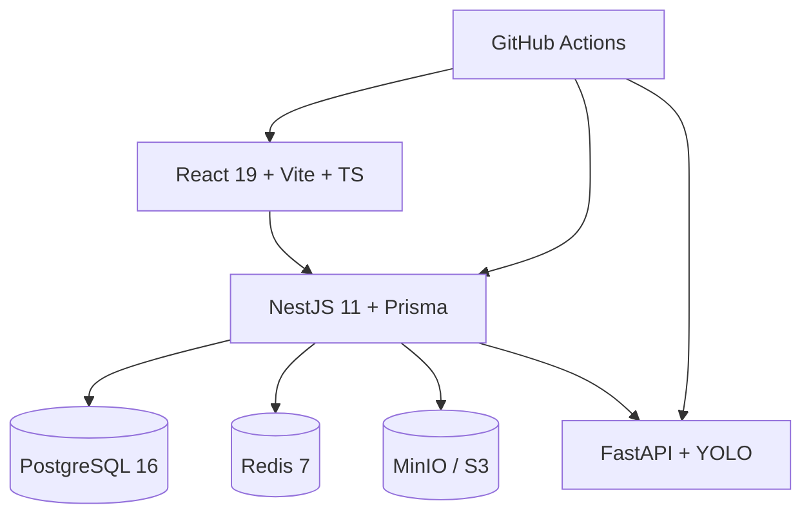

# 4. Technology Stack

Every choice is optimized for: internship delivery, enterprise maintainability, and future commercialization by Granisafe Solution.

---

## 4.1 Frontend

| Choice | Version (target) | Justification |
|--------|------------------|---------------|
| **React** | 19.x | Industry standard, large hiring pool, ecosystem |
| **TypeScript** | 5.6+ | Contract safety with backend shared types |
| **Vite** | 6.x | Fast DX, simple SPA builds |
| **React Router** | 7.x | Mature SPA routing + role-based route guards |
| **TanStack Query** | 5.x | Server state, cache, retry for reports/lists |
| **Zustand** or Redux Toolkit | Zustand 5.x preferred | Lightweight client/kiosk state; less boilerplate |
| **Tailwind CSS** | 4.x | Rapid consistent UI; design tokens via CSS variables |
| **shadcn/ui + Radix** | latest compatible | Accessible primitives without heavy vendor lock-in |
| **Zod** | 3.x | Shared runtime validation with forms |
| **Recharts** or Visx | Recharts 2.x | Simple dashboard charts for compliance stats |
| **qrcode.react** | latest | Display employee QR in admin |

**Rejected:** Angular (steeper for small team unless already skilled), Next.js SSR (unnecessary for private authenticated ops app; adds deploy complexity).

---

## 4.2 Backend (Core API)

| Choice | Version | Justification |
|--------|---------|---------------|
| **NestJS** | 11.x | Modular DI aligns with Clean Architecture + enterprise structure |
| **TypeScript** | 5.6+ | Same language as frontend |
| **Prisma** | 6.x | Productive schema-first ORM, migrations, type-safe queries |
| **Zod / class-validator** | Zod preferred at boundaries | DTO validation |
| **Passport + JWT** | passport-jwt | Standard Nest auth integration |
| **BullMQ** | 5.x | Robust job queues on Redis |
| **Swagger/OpenAPI** | Nest plugin | Contract documentation for internship defense |

**Rejected:** Django monolith (AI already Python—avoid two full web stacks for core domain), Spring Boot (heavier ops for this team profile unless Java is mandated).

---

## 4.3 Database

| Choice | Version | Justification |
|--------|---------|---------------|
| **PostgreSQL** | 16.x | ACID, rich constraints, JSON when needed, commercial standard |
| **Redis** | 7.x | Rate limit, pub/sub, BullMQ, ephemeral locks |

**Rejected:** MongoDB as primary (attendance/access are relational); SQLite (weak multi-user concurrency for demo-to-prod path).

---

## 4.4 Authentication

| Choice | Justification |
|--------|----------------|
| **JWT access tokens (15m)** | Stateless horizontal scaling |
| **Opaque/rotating refresh tokens** stored hashed in DB | Revocation control |
| **Argon2id** password hashing | Modern OWASP recommendation |
| **RBAC permission checks** via Nest guards + CASL or custom decorator matrix | Clear role matrix mapping |

Optional later: OAuth2/OIDC enterprise SSO (Keycloak)—interface reserved, not V1.

---

## 4.5 AI service

| Choice | Version | Justification |
|--------|---------|---------------|
| **Python** | 3.11/3.12 | ML ecosystem standard |
| **FastAPI** | 0.115+ | Fast, typed, easy OpenAPI |
| **Ultralytics YOLOv8 or YOLO11** | latest stable | Mature object detection for PPE classes; not a research project |
| **PyTorch** | 2.x (CPU/GPU wheels) | YOLO backend |
| **Pillow / OpenCV** | latest | Image decode & light quality checks |
| **Uvicorn** | latest | ASGI server |

**Model strategy:** Start with a pretrained PPE/construction safety weights if license-compatible, or fine-tune lightly on public PPE datasets. Freeze classes: `helmet`, `safety_vest`, `uniform` (map dataset labels → domain labels in adapter).

**Rejected:** Training a novel architecture; cloud-only Vision API as sole path (cost, offline demo, vendor lock)—allowed later as alternate adapter.

---

## 4.6 Camera streaming

| Choice | Justification |
|--------|----------------|
| **Browser `getUserMedia`** | No hardware SDK; works for kiosk demo |
| **Capture still frame (JPEG)** to API | Simpler and more reliable than continuous server streaming in V1 |
| Optional later: WebRTC / MJPEG gateway | Multi-viewer wall |

**Rejected for V1:** Direct RTSP ingestion (needs camera hardware and server media stack).

---

## 4.7 Realtime

| Choice | Justification |
|--------|----------------|
| **Socket.IO** (Nest gateway) **or** native WebSocket | Dashboard live feed |
| Redis adapter when scaling API replicas | Sticky-session free pub/sub |

SSE is acceptable alternative for one-way dashboard events; Socket.IO preferred if bi-directional kiosk commands appear.

---

## 4.8 PDF / Excel

| Choice | Justification |
|--------|----------------|
| **PDFKit** or **Puppeteer HTML→PDF** | PDFKit lighter; Puppeteer prettier—choose PDFKit for server simplicity |
| **ExcelJS** | Solid XLSX generation without Excel installed |

Reports generated async for large ranges; small ranges sync.

---

## 4.9 Deployment

| Choice | Justification |
|--------|----------------|
| **Docker + Docker Compose** | Reproducible internship demos |
| **Nginx or Traefik** | TLS termination, static SPA, reverse proxy |
| **node:22-alpine / python:3.12-slim** base images | Size vs compatibility balance |

Cloud (later): Azure/AWS/GCP VM or Kubernetes—images stay portable.

---

## 4.10 Testing

| Layer | Tools |
|-------|-------|
| Frontend unit | Vitest + Testing Library |
| Backend unit | Jest / Vitest for Nest |
| API integration | Supertest + Testcontainers (Postgres) |
| E2E | Playwright |
| AI contract | Pytest + golden images fixture set |
| Load (light) | k6 |

---

## 4.11 CI/CD

| Choice | Justification |
|--------|----------------|
| **GitHub Actions** | Ubiquitous, free tier friendly |
| Pipeline stages | lint → typecheck → unit → integration → build images → (manual) deploy staging |
| **Conventional Commits** + semantic version tags | Release clarity for commercial path |

---

## 4.12 Shared types / monorepo tooling

| Choice | Justification |
|--------|----------------|
| **pnpm workspaces** or **npm workspaces** | Simple monorepo |
| **packages/shared** Zod schemas / TS types | Single source for enums and DTOs |
| Optional **Turborepo** | Faster builds if monorepo grows |

---

## 4.13 Observability

| Choice | Justification |
|--------|----------------|
| Structured JSON logs (Pino) | Correlation IDs |
| OpenTelemetry hooks (optional V1.1) | Future APM |
| Health endpoints `/health` `/ready` | Orchestration |

---

## 4.14 Stack summary diagram

