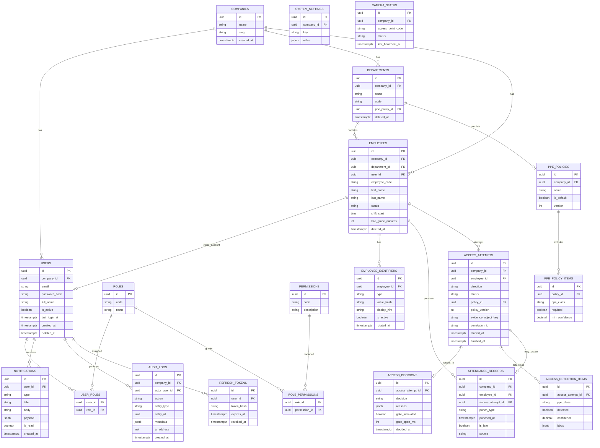

# 6. Database Design

**Engine:** PostgreSQL 16  
**ORM:** Prisma  
**Keys:** UUID (`uuid` / `gen_random_uuid()`) for public identifiers  
**Timestamps:** `timestamptz` UTC  
**Soft delete:** `deleted_at` where historical integrity matters  

Reserved for commercialization: nullable `company_id` on tenant-owned tables (unused in V1 UI).

---

## 6.1 ER diagram

---

## 6.2 Table dictionary

### `companies`
Why: Commercial multi-tenant foundation; V1 seeds one row (“Granisafe Demo”).  
PK: `id`. Unique: `slug`.

### `users`
Why: Login principals for Admin/Guard/Supervisor/HR/Employee portal users.  
Unique: `(company_id, email)`. Index: `(company_id, is_active)`.

### `roles` / `permissions` / `user_roles` / `role_permissions`
Why: Explicit RBAC instead of hardcoding only in JWT claims—auditability and future custom roles.  
Unique: `roles.code`, `permissions.code`. Composite PKs on join tables.

### `departments`
Why: Org structure + optional PPE policy override.  
Unique: `(company_id, code)`.

### `employees`
Why: Site workers subject to access/attendance—even without portal login.  
Unique: `(company_id, employee_code)`.  
`status`: `ACTIVE` | `INACTIVE`.  
FK `user_id` optional 1:1 for portal linkage.

### `employee_identifiers`
Why: Support QR and RFID without polluting employee row; enable rotation.  
`type`: `QR` | `RFID`.  
Store **hash** of secret payload (QR token); `display_hint` last4 for UI.  
Unique active value hash globally/company-scoped. Index: `(type, value_hash)` where `is_active`.

### `ppe_policies` / `ppe_policy_items`
Why: Configurable required PPE + thresholds; versioned for historical attempts.  
`ppe_class`: `HELMET` | `SAFETY_VEST` | `UNIFORM`.  
Check: `min_confidence` between 0 and 1.

### `access_attempts`
Why: System-of-record for each identify→inspect cycle.  
`direction`: `ENTRY` | `EXIT`.  
`status`: `IN_PROGRESS` | `GRANTED` | `DENIED` | `ERROR`.  
Indexes: `(employee_id, started_at DESC)`, `(status, started_at DESC)`, `(started_at)`.

### `access_decisions`
Why: Separates immutable decision payload from attempt lifecycle.  
1:1 with attempt. `reasons` JSON array of codes/messages.

### `access_detection_items`
Why: Persist per-class AI outputs for reports and disputes.  
Index: `(access_attempt_id)`.

### `attendance_records`
Why: HR attendance ledger distinct from security events.  
`punch_type`: `ENTRY` | `EXIT`.  
`source`: `ACCESS_GRANT` | `MANUAL` (manual reserved, Admin-only future).  
Indexes: `(employee_id, punched_at)`, `(punched_at)`, partial unique to support cooldown rules in app layer.  
FK to `access_attempt_id` nullable for future manual punches.

### `notifications`
Why: In-app notification center.  
Index: `(user_id, is_read, created_at DESC)`.

### `audit_logs`
Why: Who changed what—security & internship evaluation evidence.  
**Append-only** (no update/delete APIs). Index: `(entity_type, entity_id)`, `(actor_user_id, created_at)`.

### `refresh_tokens`
Why: Revocable sessions. Index: `(user_id)`, `(expires_at)`.

### `system_settings`
Why: Grace minutes, cooldown, retention days, fail-closed toggles.  
Unique: `(company_id, key)`.

### `camera_status`
Why: Dashboard camera health without hardware NMS. Updated by kiosk heartbeats.

---

## 6.3 Critical constraints

| Constraint | Detail |
|------------|--------|
| Employee active for access | Enforced in use case + optional DB check via status |
| One open ENTRY session | Enforced in application transaction (query open ENTRY without EXIT) |
| Identifier uniqueness | Unique on active QR/RFID hashes |
| Decision completeness | `GRANTED`/`DENIED` attempts must have `access_decisions` row |
| Attendance on grant ENTRY only | Application invariant + integration tests |
| Cascade rules | Soft-delete employees; hard FKs restrict deleting referenced dims |

---

## 6.4 Indexing strategy (summary)

- Equality lookups on codes/emails/hashes.
- Time-series queries on `access_attempts.started_at`, `attendance_records.punched_at`.
- Dashboard filters on `status` + time.
- Avoid over-indexing write-heavy columns without query evidence.

---

## 6.5 Retention

| Data | Default V1 |
|------|------------|
| Evidence images | 90 days (configurable) |
| Access attempts | 12 months |
| Audit logs | 12 months minimum |
| Notifications | 30 days read / 90 days unread purge job |

Job: scheduled cleanup worker in API.

---

## 6.6 Why not store video

Frames are enough for PPE proof and storage cost control. Video deferred to future analytics.
