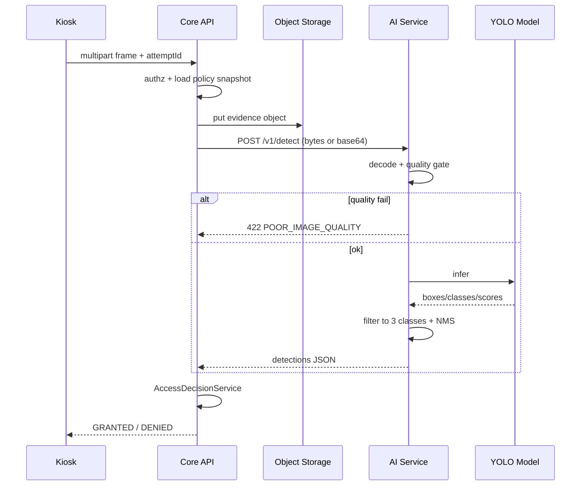

# 9. AI Module Design

## 9.1 Scope boundary

The AI service **only** detects:

| Domain class | Model label mapping |
|--------------|---------------------|
| Helmet | `helmet` / `hardhat` → `HELMET` |
| Safety vest | `safety_vest` / `vest` → `SAFETY_VEST` |
| Uniform | `uniform` / closest dataset proxy → `UNIFORM` |

No face recognition, pose identity, LPR, fire/smoke.

**Product rule:** Core API owns business decisions. AI returns observations only.

---

## 9.2 End-to-end detection flow



---

## 9.3 How frames arrive

1. Guard kiosk requests camera permission via browser.
2. Preview stream stays local (`MediaStream`).
3. On identify success, UI captures a canvas snapshot → JPEG (quality ~0.85).
4. Frame uploaded to **Core API** (not directly to AI) so evidence, auth, and policy stay centralized.
5. API forwards bytes to AI over internal network.

**Justification:** Browser never holds AI API keys; evidence storage is consistent; audit trail is complete.

---

## 9.4 Quality gate (pre-inference)

Reject or soft-fail before model if:

| Check | Default rule |
|-------|----------------|
| Min resolution | ≥ 640×480 |
| File size | 20KB–5MB |
| Mean luminance | not near-black / near-white extremes |
| Decode errors | hard fail |

Mapped reason: `POOR_IMAGE_QUALITY` (deny or retry—see retry policy).

---

## 9.5 Detection execution

1. **Model loader** loads YOLO weights once at startup (`on_event` lifespan).
2. Warmup inference with blank/tiny tensor to reduce first-request latency.
3. Per request:
   - Decode image
   - Run predict with configured `imgsz` (e.g. 640)
   - Apply confidence floor at model level (e.g. 0.25) for candidate boxes
   - Keep max boxes; NMS handled by Ultralytics
4. Map labels through `LabelAdapter` to domain enums.
5. Aggregate **per class**: `detected = max(confidence) >= policy threshold` (thresholds applied in Core API; AI may also return raw max confidence per class).

**Preferred split:**
- AI returns raw detections (class, confidence, bbox).
- Core API applies per-policy thresholds and required flags.

This keeps policy changes instant without reloading models.

---

## 9.6 Confidence thresholds

| Class | Default min confidence | Notes |
|-------|------------------------|-------|
| HELMET | 0.70 | Critical safety item |
| SAFETY_VEST | 0.70 | Critical |
| UNIFORM | 0.65 | Often visually noisier; slightly lower default |

Admin-configurable via PPE policy items.  
Decision: class passes iff `required && confidence >= minConfidence` or `!required`.

Borderline band (optional P2): if confidence in `[min-0.05, min)` allow **one guided retry** before final deny.

---

## 9.7 Retry logic

| Layer | Policy |
|-------|--------|
| Kiosk UX | Max **2** automatic recaptures on `POOR_IMAGE_QUALITY` or timeout |
| Core API → AI | Max **1** retry on transient 503/timeout; same `requestId` |
| Idempotency | Inspect endpoint respects `Idempotency-Key` |
| Business deny | No infinite retry loops; final DENIED after budget |

Timeouts: API client to AI default **3s** (CPU profile may use 5s).

---

## 9.8 Error handling matrix

| Condition | AI response | Core API decision |
|-----------|-------------|-------------------|
| Model not loaded | 503 | DENIED `AI_UNAVAILABLE` + notify |
| Inference exception | 500 | DENIED `AI_ERROR` + notify |
| Timeout | client timeout | DENIED `AI_TIMEOUT` |
| Poor image | 422 | retry or DENIED `POOR_IMAGE_QUALITY` |
| Empty detections | 200 empty list | DENIED missing all required |
| Unexpected classes | ignored | only mapped classes count |

**Fail-closed** always for access ENTRY.

---

## 9.9 Model loading & versioning

```text
MODEL_PATH=/models/ppe-yolo.pt
MODEL_VERSION=ppe-yolo-2026.08.1
DEVICE=cuda|cpu|auto
```

- Health endpoint reports `modelVersion`, `device`, `loaded=true/false`.
- Rolling update: new container with new weights; API remains unchanged.
- Document dataset license and limitations in `apps/ai-service/README.md`.

---

## 9.10 Performance considerations

| Tactic | Why |
|--------|-----|
| Keep AI service sticky to one model in memory | Avoid reload cost |
| Limit image size client-side before upload | Bandwidth + latency |
| GPU when available; CPU acceptable for demo | Internship realism |
| Horizontal scale AI replicas behind internal LB later | Throughput |
| Do not batch across employees in V1 | Simpler correctness |
| Store only JPEG evidence, not raw video | Cost |
| Metricize `inferenceMs` | Capacity planning |

Target: p95 inference ≤ 1.5s GPU / ≤ 3s CPU.

---

## 9.11 Security of AI module

- Bind to internal Docker network only.
- Require API key from Core API.
- No PII required in AI payload beyond image; `requestId` is opaque.
- Do not log full images by default; optional debug flag off in prod.

---

## 9.12 Testing the AI module

| Test type | Content |
|-----------|---------|
| Unit | Label mapping, aggregation helpers |
| Contract | Fixed fixture images → expected classes present/absent |
| Regression golden set | 30–50 labeled stills (helmet/vest/uniform combos) |
| Negative | Blurry, dark, no-person images |
| Load | Sustained 2–5 RPS smoke on CPU |

Acceptance for internship: demonstrable correct grant/deny on controlled demo images + live camera happy path—not SOTA metrics.

---

## 9.13 Explicit non-goals

- Continuous video analytics
- Tracking IDs across frames
- Personalized PPE per employee beyond policy
- On-device mobile inference in V1
