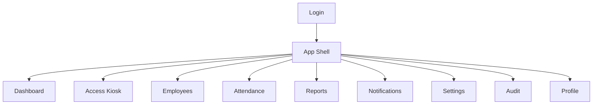
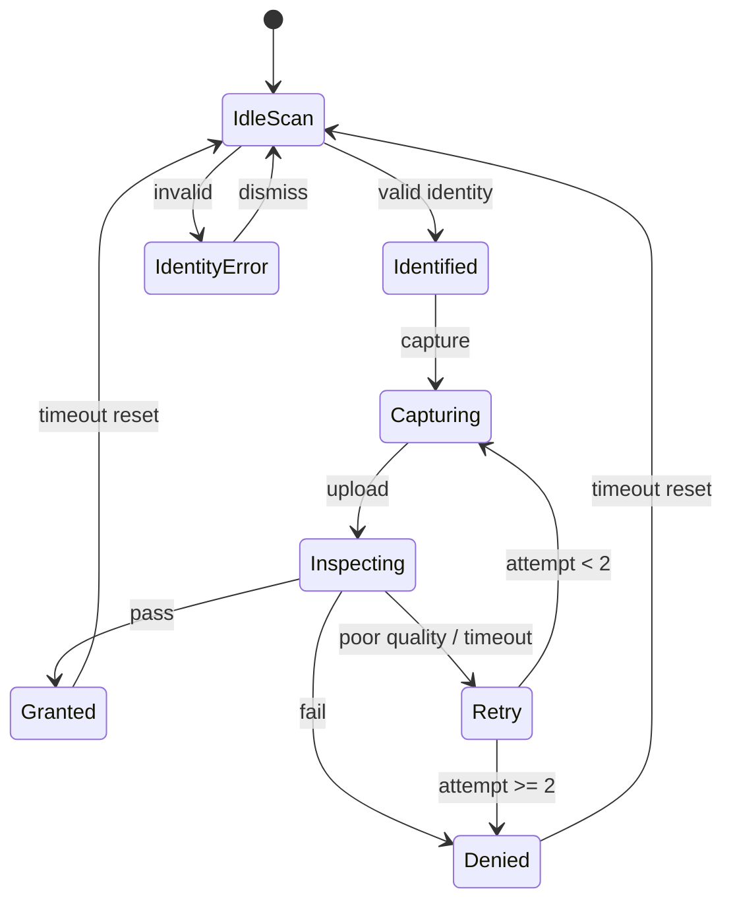

# 10. UI/UX Design

## 10.1 Design principles

1. **Two UX modes:** dense Admin console vs high-visibility Guard kiosk.
2. **Decision-first kiosk:** huge GRANTED/DENIED state; reasons readable at distance.
3. **One job per page** in operational flows.
4. **Brand:** Granisafe industrial trust—deep slate, safety amber accent, clear typography (not generic purple SaaS).
5. **Motion:** subtle status transitions (scan → inspecting → decision), not decorative noise.
6. **Role-based navigation:** users only see allowed modules.

---

## 10.2 Information architecture / navigation



**Primary nav (left sidebar for admin roles; simplified top bar for kiosk):**

| Item | Roles |
|------|-------|
| Dashboard | Admin, Guard, Supervisor, HR |
| Access Control | Admin, Guard |
| Employees | Admin, HR, Supervisor (view), Guard (view) |
| Attendance | Admin, HR, Supervisor, Guard/Employee (self) |
| Reports | Admin, HR, Supervisor |
| Notifications | All staff |
| Settings | Admin |
| Users | Admin |
| Audit Logs | Admin |
| Profile | All |

---

## 10.3 Page inventory

### 10.3.1 Login

**Purpose:** Authenticate users.  
**Elements:** Brand mark, email, password, submit, error alert, optional “kiosk mode” hint.  
**States:** idle, submitting, invalid credentials, locked/rate limited.

```mermaid
wireframe
  Login page
  +----------------------------------+
  |         GRANISAFE                |
  |      Smart Access                |
  |                                  |
  |  Email    [..................]   |
  |  Password [..................]   |
  |           [ Sign in ]            |
  |  error text                      |
  +----------------------------------+
```

*(Mermaid wireframe above is conceptual; implement as layout sketch in design review.)*

**ASCII wireframe:**

```text
┌─────────────────────────────────────┐
│           GRANISAFE                 │
│         Smart Access                │
│                                     │
│  Email     ___________________      │
│  Password  ___________________      │
│            [ Sign in ]              │
└─────────────────────────────────────┘
```

---

### 10.3.2 Dashboard

**Purpose:** Operational awareness.  
**Widgets (not card-spam: clear metric strip + live feed):**
- On-site count
- Entries today / Denied today
- AI status / Camera status
- Live recent access list (grant/deny badges)
- Quick link: Open Access Kiosk

```text
┌─ Sidebar ─┬──────────────────────────────────────────┐
│ Dashboard │ On-site 128   In 340   Denied 27         │
│ Access    │ AI: UP   Camera GATE-1: ONLINE           │
│ Employees │──────────────────────────────────────────│
│ ...       │ Recent access                            │
│           │ 10:42 GRANTED  Karim B.  Welding         │
│           │ 10:41 DENIED   No helmet  Sara M.        │
└───────────┴──────────────────────────────────────────┘
```

---

### 10.3.3 Access Kiosk / Live Camera

**Purpose:** Primary safety control surface.  
**Layout:** Full-bleed camera preview plane; identity panel; decision overlay after inspect.

**Flow steps UI:**
1. Scan QR / type RFID  
2. Show employee + required PPE checklist  
3. Auto/manual capture  
4. “Inspecting…” progress  
5. Full-screen decision (green/red industrial, not playful)  
6. Auto-reset after N seconds

```text
┌────────────────────────────────────────────────────┐
│ GATE-1        ENTRY mode            Guard: Sara    │
│┌──────────────────────────────────────┐  Scan QR   │
││                                      │  [.####]   │
││         CAMERA PREVIEW               │  Employee  │
││                                      │  Karim B.  │
││                                      │  ☐ Helmet  │
││                                      │  ☐ Vest    │
││                                      │  ☐ Uniform │
│└──────────────────────────────────────┘  [Inspect] │
└────────────────────────────────────────────────────┘

Decision state:
┌────────────────────────────────────────────────────┐
│                   ACCESS DENIED                    │
│              Missing: Helmet                       │
│              Retry in 3…                           │
└────────────────────────────────────────────────────┘
```

---

### 10.3.4 Employees

**Purpose:** HR/Admin workforce registry.  
**Views:** Table (search, dept filter, status) → Detail drawer/page.  
**Actions:** Create, edit, activate/deactivate, generate/download QR, set RFID.

```text
┌─ Employees ────────────────────────── [+ Add] ─────┐
│ Search ____  Dept [All▾]  Status [Active▾]         │
│ Code   Name          Dept      Status   QR         │
│ EMP-1  Karim Benali  Welding   Active   [View]     │
└────────────────────────────────────────────────────┘
```

---

### 10.3.5 Attendance

**Purpose:** History & current presence.  
**Tabs:** Current on-site | History  
**Filters:** Date range, department, employee, late only.  
**Employee role:** Only self history.

---

### 10.3.6 Reports

**Purpose:** Compliance & HR exports.  
**Report types:** Attendance, Rejections, PPE compliance.  
**Controls:** Date range, dept, format PDF/XLSX, Generate.  
**Result:** Job status + download button.

---

### 10.3.7 Notifications

**Purpose:** Alert inbox.  
**List:** Unread first; types: rejection, camera offline, AI unavailable.  
**Actions:** Mark read, mark all read, deep-link to event.

---

### 10.3.8 Settings

**Purpose:** Admin configuration.  
**Sections:**
- PPE policy thresholds
- Late grace / shift defaults
- Duplicate scan cooldown
- Gate open duration (ms)
- Evidence retention days
- Fail-closed toggles (display-only confirmation)

---

### 10.3.9 Users & Roles (Admin)

**Purpose:** Provision staff accounts and assign roles.  
Table + invite/create form + role select.

---

### 10.3.10 Audit Logs

**Purpose:** Forensics.  
Filters: actor, action, entity, date. Read-only table.

---

### 10.3.11 Profile

**Purpose:** Self-service.  
Fields: name (limited), email (read-only unless admin), change password.

---

## 10.4 Wireframe — kiosk state machine



---

## 10.5 UX copy guidelines

- Prefer “Helmet not detected” over model jargon.
- Always show next action (“Adjust position and retry”).
- Never imply face recognition.
- On AI outage: “Safety verification unavailable — access denied.”

---

## 10.6 Responsive behavior

| Surface | Behavior |
|---------|----------|
| Admin pages | Desktop-first; usable tablet |
| Kiosk | Landscape desktop/tablet fixed; mobile not primary |
| Reports tables | Horizontal scroll on narrow screens |

---

## 10.7 Accessibility

- Contrast-compliant decision colors with text labels (not color-only).
- Keyboard access for admin forms.
- Focus states on controls.
- Live regions for decision announcements on kiosk.
