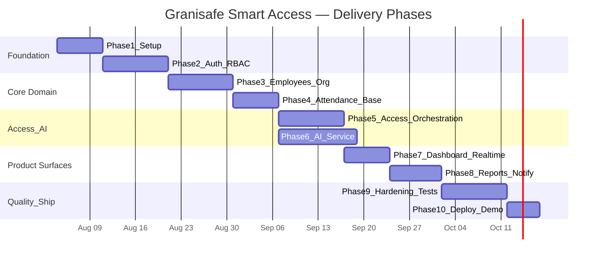

# 12. Development Roadmap

Development starts **only after architecture validation**.  
Principle: each phase ships a demoable increment with stable contracts to minimize refactoring.

---

## 12.1 Phase overview

> Dates are illustrative; adjust to internship calendar. Phases 5–6 can overlap once access DTOs are frozen.

---

## 12.2 Phase 1 — Project setup

**Goal:** Runnable empty shells.

- Monorepo (pnpm workspaces)
- `apps/web`, `apps/api`, `apps/ai-service` scaffolds
- Docker Compose: Postgres, Redis, MinIO
- Lint/format/typecheck CI skeleton
- `.env.example`, README quickstart
- ADR-001: modular monolith + AI sidecar

**Exit criteria:** `compose up` healthchecks green; Hello World API + blank React page.

---

## 12.3 Phase 2 — Authentication & RBAC

**Goal:** Secure multi-role login.

- Users, roles, permissions schema + seed
- Register (admin bootstrap), login, refresh, logout
- Password hashing, JWT guards
- Frontend login + route guards + role nav shell
- Audit: login + role assignment

**Exit criteria:** Five seeded users (one per role) see different menus; unauthorized API → 403.

---

## 12.4 Phase 3 — Employee & organization module

**Goal:** Workforce master data + QR.

- Departments CRUD
- Employees CRUD + soft delete + status
- QR generate/regenerate + display/download
- Optional RFID field
- Employee list/detail UI

**Exit criteria:** HR can create employee and print QR; Guard can view list.

---

## 12.5 Phase 4 — Attendance foundation

**Goal:** Attendance model ready before AI wiring.

- Attendance tables + query APIs
- Current on-site calculation helpers
- Late flag utility (shift + grace)
- Attendance history UI (no AI yet)
- Manual simulation seeder for demos

**Exit criteria:** Seeded punches visible with filters; late computed correctly in unit tests.

---

## 12.6 Phase 5 — Access control orchestration (without final model)

**Goal:** Full access state machine using a **FakeAiAdapter**.

- Identify by QR/RFID
- Attempt lifecycle + evidence upload to MinIO
- Decision service + policy engine
- Gate simulation adapter
- Wire ENTRY → attendance on grant
- Kiosk UI flow with mock detections toggle

**Exit criteria:** End-to-end grant/deny using stubbed detections; no refactor needed when real AI connects.

**Why Fake AI first:** Unblocks UI/backend; AI becomes drop-in adapter—minimizes late integration risk.

---

## 12.7 Phase 6 — AI PPE service

**Goal:** Real detections for 3 classes.

- FastAPI detect/health
- Model load + inference
- Label adapter + quality gate
- Replace FakeAiAdapter with HttpAiAdapter
- Golden image tests
- Fail-closed + notifications triggers for AI down

**Exit criteria:** Live camera demo grants when PPE present; denies when helmet removed; AI kill switch denies + alerts.

---

## 12.8 Phase 7 — Live dashboard & realtime

**Goal:** Operations visibility.

- Summary endpoint
- WebSocket events for new access attempts
- Camera heartbeat from kiosk
- Dashboard UI polish

**Exit criteria:** Second browser shows live denials without refresh.

---

## 12.9 Phase 8 — Reports, notifications, audit UX

**Goal:** Internship “enterprise completeness.”

- Notification center
- Attendance / rejections / compliance reports
- PDF + Excel export jobs
- Audit log screen
- Settings screen (thresholds, grace, cooldown)

**Exit criteria:** HR exports monthly attendance; Admin reviews audit; Guard sees denial notifications.

---

## 12.10 Phase 9 — Testing & hardening

**Goal:** Defense-ready quality.

- Unit coverage on decision/attendance domain
- Integration tests (Testcontainers)
- Playwright happy paths
- Security pass (authz matrix, upload limits)
- Performance smoke (k6 light)
- Bugfix from UAT checklist

**Exit criteria:** CI green; UAT sign-off checklist completed.

---

## 12.11 Phase 10 — Deployment & demo packaging

**Goal:** Reproducible defense demo.

- Prod compose / VM deploy guide
- Backup script for Postgres
- Seed demo dataset + demo script storyboard
- Logging/monitoring basics
- Version tag `v1.0.0`

**Exit criteria:** Cold start to demo in ≤ 30 minutes on clean machine.

---

## 12.12 Prioritized module order (minimal refactor)

| Order | Module | Depends on | Stability commitment |
|------:|--------|------------|----------------------|
| 1 | Platform shell + shared types | — | Enums frozen early |
| 2 | Auth/RBAC | 1 | Permission codes frozen |
| 3 | Org/Employees/QR | 2 | Identifier contract frozen |
| 4 | PPE Policy | 2 | Class enum frozen |
| 5 | Attendance core | 3 | Punch model frozen |
| 6 | Access orchestrator + GatePort | 3–5 | Attempt DTO frozen |
| 7 | AI service + AiDetectorPort | 6 | Detect API frozen |
| 8 | Dashboard/Realtime | 6 | Event names frozen |
| 9 | Reports/Notifications/Audit UI | 6–8 | — |
| 10 | Hardening/Deploy | all | — |

---

## 12.13 Definition of Done (every phase)

- Migrations committed
- OpenAPI updated for new endpoints
- Unit tests for domain rules touched
- README phase notes updated
- Demo path still works (smoke)

---

## 12.14 Suggested internship milestones for mentors

1. Architecture validation (this pack)  
2. Auth + Employees demo  
3. Access with Fake AI demo  
4. Real AI PPE demo  
5. Full platform + reports defense build  
