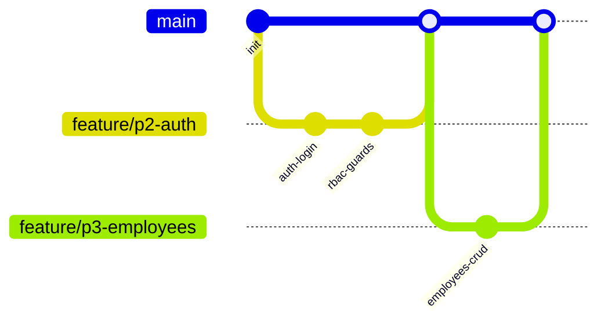

# 13. Git Strategy

## 13.1 Branching model

**Model:** Trunk-based with short-lived branches (GitHub Flow variant).

| Branch | Purpose |
|--------|---------|
| `main` | Always deployable; protected |
| `develop` (optional) | Integration branch if mentors prefer; else merge to `main` via PR |
| `feature/<phase>-<slug>` | Feature work |
| `fix/<issue>-<slug>` | Bugfixes |
| `chore/<slug>` | Tooling/docs |
| `release/x.y.z` | Freeze for demo tag if needed |

**Justification:** Internship teams move faster with short PRs than heavy GitFlow; still commercial-friendly.



---

## 13.2 Commit naming

**Convention:** [Conventional Commits](https://www.conventionalcommits.org/)

```text
<type>(optional-scope): <imperative summary>

[optional body]
```

Types: `feat`, `fix`, `docs`, `refactor`, `test`, `chore`, `perf`, `ci`, `build`.

Examples:
- `feat(access): add identify endpoint with QR resolution`
- `fix(attendance): prevent double ENTRY within cooldown`
- `docs(architecture): clarify fail-closed AI policy`
- `test(ai): add golden images for helmet denial`

Rules:
- Present tense, imperative
- ≤ 72 chars subject when possible
- One logical change per commit when practical

---

## 13.3 Pull requests

- PR required into `main` (or `develop`).
- Template sections: Summary, Test plan, Screenshots (UI), Risk.
- Checks must pass: lint, typecheck, unit tests, build.
- At least one reviewer when available (mentor/peer).
- Prefer PR size < ~400 LOC net when possible; split by module.
- Delete branch after merge.

---

## 13.4 Versioning

**SemVer** for product releases:

| Version | Meaning |
|---------|---------|
| `v0.x.y` | Pre-defense increments |
| `v1.0.0` | Internship V1 defense/demo freeze |
| `v1.1.0` | Backward-compatible additions (RFID polish, etc.) |
| `v2.0.0` | Breaking API/hardware platform changes |

Tag format: `v1.0.0`. Changelog via Conventional Commits (optional `CHANGELOG.md` generation).

API version (`/api/v1`) is independent of marketing SemVer; bump API URL only on breaking HTTP contracts.

---

## 13.5 Repository hygiene

- `.gitignore`: env, node_modules, model weights (use LFS or download script), uploads, coverage
- Protect `main`: no force push
- CODEOWNERS optional for `docs/architecture` and `**/domain/**`
- Never commit secrets; rotate if leaked
