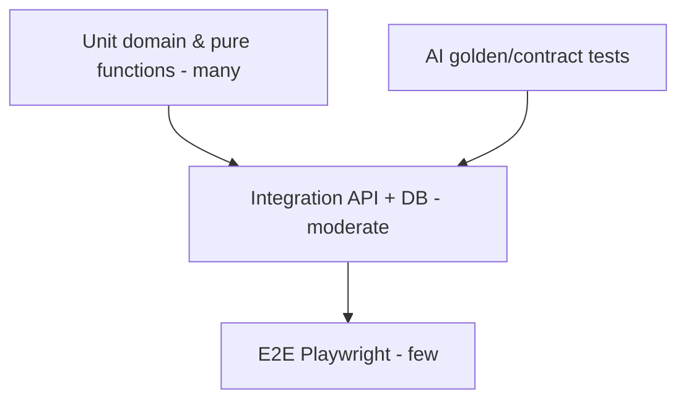

# 14. Testing Strategy

## 14.1 Test pyramid

**Justification:** Domain rules (access decision, late calculation, cooldown) must be unit-tested heavily—cheap and stable. E2E covers critical journeys only.

---

## 14.2 Unit tests

| Area | Examples |
|------|----------|
| `AccessDecisionService` | Missing helmet → DENIED; all pass → GRANTED |
| Policy resolution | Dept override beats default |
| Late calculator | Within grace / after grace |
| Identifier hashing | Rotation invalidates old token semantics |
| RBAC helper | Permission matrix evaluation |
| Frontend utils | QR payload formatting, form schemas |

Tools: Jest/Vitest (API/web), Pytest (AI pure helpers).

Target: critical domain ≥ 80% coverage; not vanity 100% on controllers.

---

## 14.3 Integration tests

- Nest + Testcontainers PostgreSQL (+ Redis if needed)
- Auth login → authorized create employee → identify QR
- Inspect with Fake AI → attendance row created/not created
- Soft-delete employee → identify fails
- Report job completes for small dataset

Tools: Supertest, Testcontainers.

---

## 14.4 AI validation tests

| Suite | Purpose |
|-------|---------|
| Contract | `/v1/detect` schema stable |
| Golden images | Known PPE present/absent |
| Quality gate | Dark/tiny images rejected |
| Resilience | Model unload → 503 |
| Mapping | Dataset labels → domain classes |

**Acceptance:** Not academic mAP; internship bar is reliable demo scenarios + documented limitations.

---

## 14.5 Performance tests

| Test | Tool | Budget |
|------|------|--------|
| Identify endpoint | k6 | p95 < 300ms @ 20 VUs |
| Inspect with Fake AI | k6 | p95 < 500ms @ 10 VUs |
| Inspect with real AI | k6 light | p95 within NFR on reference hardware |
| Dashboard summary | k6 | p95 < 300ms |

Run on staging-like Compose, not laptop-as-gospel—record environment in report.

---

## 14.6 Security tests

- Automated authz matrix: each role × sensitive endpoint
- Brute-force login triggers 429
- Upload non-image rejected
- JWT tampering rejected
- OWASP ZAP baseline on staging
- Dependency audits in CI

---

## 14.7 End-to-end tests (Playwright)

Critical paths only:

1. Admin login → create employee → show QR  
2. Guard login → identify → grant (stub/real) → appears on dashboard  
3. Deny path shows reasons  
4. HR export attendance (small range)  
5. Employee sees only self attendance  

---

## 14.8 User Acceptance Testing (UAT)

| ID | Scenario | Pass criteria |
|----|----------|---------------|
| UAT-01 | Employee with full PPE | Access granted, attendance ENTRY, gate animation |
| UAT-02 | Remove helmet | Denied with helmet reason, no ENTRY |
| UAT-03 | Inactive employee QR | Denied without AI call |
| UAT-04 | Stop AI container | Denied AI unavailable + notification |
| UAT-05 | Exit flow | EXIT punch closes session |
| UAT-06 | Late arrival | `is_late=true` when after grace |
| UAT-07 | Role separation | HR cannot open Settings |
| UAT-08 | Report export | File downloads and opens |
| UAT-09 | QR regenerate | Old QR rejected |
| UAT-10 | Audit | Policy change visible in audit log |

UAT executed with mentor checklist; defects triaged before `v1.0.0`.

---

## 14.9 CI gating

On every PR:
1. Lint + typecheck  
2. Unit tests  
3. Integration tests (where runners allow)  
4. Build Docker images (optional on PR, required on main)

Nightly/manual: Playwright, k6 smoke, ZAP.
