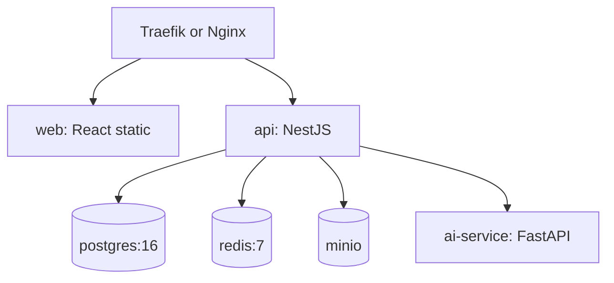

# 15. Deployment

## 15.1 Environments

| Environment | Purpose | Data |
|-------------|---------|------|
| **Development** | Local machine | Seed/demo, disposable |
| **Testing/Staging** | Pre-demo validation | Anonymized/seed copy |
| **Production** | Live site (post-internship / pilot) | Real employees |

Promotion path: build images once → deploy same digest to staging → tag → prod.

---

## 15.2 Docker topology



Compose files:
- `docker-compose.yml` — base services
- `docker-compose.dev.yml` — hot reload mounts
- `docker-compose.prod.yml` — restart policies, resource limits, TLS

---

## 15.3 Environment variables (catalog)

| Variable | Service | Purpose |
|----------|---------|---------|
| `DATABASE_URL` | api | Postgres connection |
| `REDIS_URL` | api | Cache/queue |
| `JWT_ACCESS_SECRET` | api | Access token signing |
| `JWT_REFRESH_SECRET` | api | Refresh signing/pepper |
| `ARGON2_*` / hash params | api | Password hashing config |
| `S3_ENDPOINT` `S3_ACCESS_KEY` `S3_SECRET_KEY` `S3_BUCKET` | api | Evidence storage |
| `AI_BASE_URL` | api | Internal AI URL |
| `AI_API_KEY` | api + ai | Service auth |
| `MODEL_PATH` `MODEL_VERSION` `DEVICE` | ai | Inference config |
| `CORS_ORIGINS` | api | Frontend allowlist |
| `GATE_OPEN_MS` | api | Simulation duration default |
| `LOG_LEVEL` | api/ai | Logging |
| `VITE_API_BASE_URL` | web build | API URL |

Provide `.env.example` with safe placeholders only.

---

## 15.4 Development

```text
pnpm install
docker compose -f deploy/compose/docker-compose.yml -f deploy/compose/docker-compose.dev.yml up -d
pnpm --filter api prisma migrate dev
pnpm --filter api seed
pnpm dev   # api + web
```

AI either Compose service or local uvicorn with CPU weights.

---

## 15.5 Testing / staging

- Compose prod-like config without public AI ports
- Seed script + UAT accounts
- HTTPS via Traefik self-signed or internal CA
- Enable tighter rate limits than local

---

## 15.6 Production

- Single VM or small cloud instance for pilot (2–4 vCPU, 8–16GB; GPU optional)
- Reverse proxy TLS with real certs
- Bind Postgres/Redis/MinIO/AI to private network only
- Resource limits on AI container
- Rolling restart friendly: API stateless

---

## 15.7 Backup strategy

| Asset | Method | Frequency |
|-------|--------|-----------|
| PostgreSQL | `pg_dump` compressed | Daily + before demos |
| Object storage evidence | Bucket versioning / sync | Daily |
| Secrets | Offline password manager | On rotate |
| Model weights | Artifact registry / checksummed file | On model change |

Retention: 7 daily + 4 weekly (adjust to policy).  
Test restore once before final defense.

---

## 15.8 Logging

- JSON structured logs (Pino) with `correlationId` / `attemptId`
- Access attempts always persisted in DB (not only logs)
- Log shipping optional (Loki/ELK) in future
- Never log passwords, tokens, full QR secrets, or raw image base64

---

## 15.9 Monitoring

| Signal | How |
|--------|-----|
| API/AI health | `/health` `/ready` probes |
| Container status | Docker healthchecks |
| Error rate | Log metrics / simple uptime checker |
| Disk (evidence) | Volume monitoring alert |
| AI latency | histogram of `inferenceMs` |

V1 minimum: healthchecks + admin dashboard status + disk alarm.  
V1.1: OpenTelemetry + Grafana.

---

## 15.10 Demo runbook (cold start)

1. Install Docker + pnpm  
2. Copy `.env.example` → `.env`  
3. `docker compose up -d --build`  
4. Run migrations + seed  
5. Open web URL; login Guard  
6. Verify AI health green  
7. Execute UAT-01/02 storyboard  

Target: ≤ 30 minutes.
