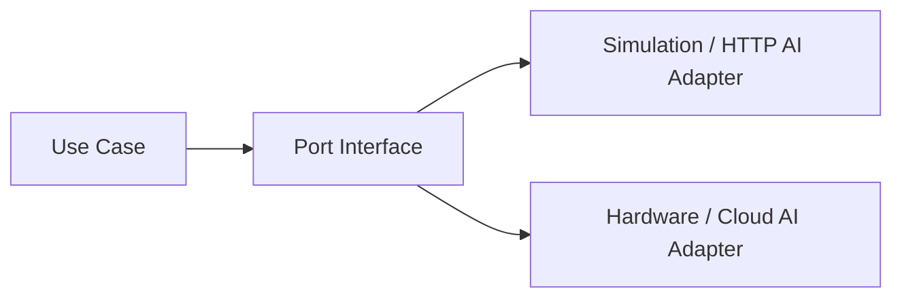

# 16. Future Improvements

V1 deliberately stops at software simulation. The architecture reserves ports/adapters so these land with minimal refactor.

---

## 16.1 Near-term (V1.1)

| Item | Value | Hook already planned |
|------|-------|----------------------|
| RFID reader integration | Faster identification | `employee_identifiers` + identify API |
| Multi-camera per site | Throughput | `camera_status.access_point_code` |
| Email/SMS notifications | Offline alerting | Notification channel port |
| Better PPE model / fine-tune | Accuracy | AI service swap weights |
| SSO (OIDC/Keycloak) | Enterprise IT | Auth module strategy interface |
| i18n FR/EN complete | Maghreb/EU markets | UI string keys |

---

## 16.2 Mid-term (V2)

| Item | Notes |
|------|-------|
| **Face verification** (optional second factor) | Separate biometrics module; privacy impact assessment required; not mixed into PPE detector |
| **Turnstile / gate controller** | Implement `GatePort` hardware adapter (relay/HTTP PLC) |
| **Mobile application** | Employee self-service + supervisor push; reuse `/api/v1` |
| **Cloud deployment** | Managed Postgres, S3, GPU inference endpoint |
| **Multi-company / multi-site** | Activate `company_id`, site hierarchy, billing later |
| **AI analytics** | Trends, heatmaps, chronic non-compliance — batch jobs, not kiosk path |

---

## 16.3 Long-term productization (Granisafe commercial)

- Tenant self-service onboarding
- Hardware appliance + cloud hybrid
- Marketplace of PPE policy templates by industry
- SLA monitoring & multi-region
- Certified security audit / ISO-aligned processes
- Offline edge mode with sync

---

## 16.4 Explicitly still out of product core (unless new product line)

Payroll, ERP, inventory, accounting, fire/smoke detection, LPR—keep integrations as external events if ever needed.

---

## 16.5 Extension pattern (do not violate)

Any future feature that requires changing domain decision rules must go through ADR + versioned policy—not silent model changes.
